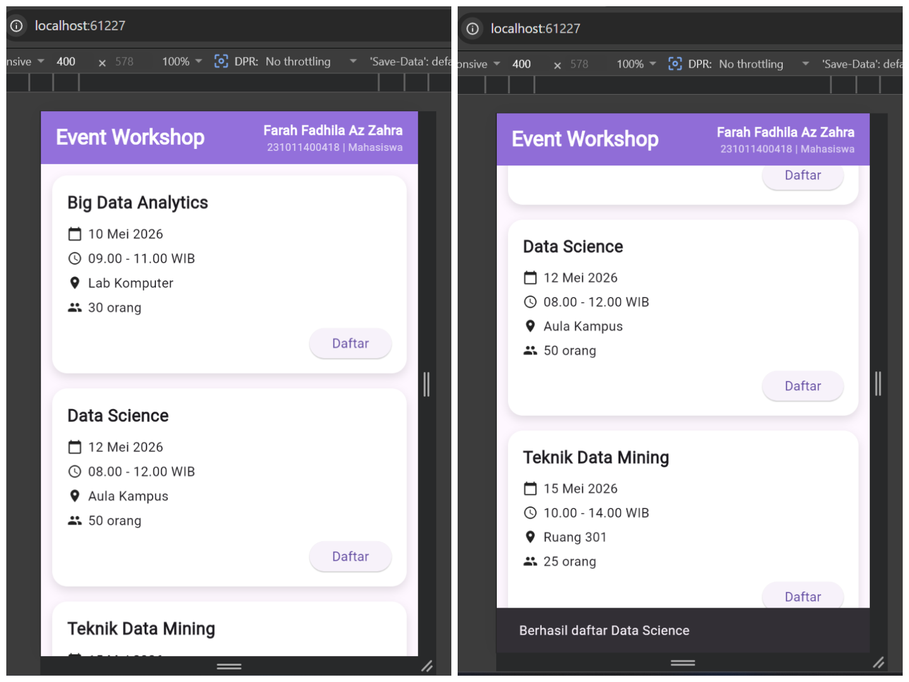

# Jawaban Soal no 1

# 1. Sketsa Layout Halaman Utama

Halaman utama aplikasi menampilkan judul “Event Workshop” pada bagian atas. Di sebelah kanan terdapat nama, NIM, dan status pengguna. Di bawahnya terdapat beberapa card workshop yang bisa discroll. Setiap card berisi judul workshop, tanggal, jam, lokasi, kuota, dan tombol daftar.

---

# 2. Alasan Pemilihan Widget

- **Scaffold** digunakan sebagai struktur utama aplikasi agar tampilan halaman lebih rapi dan teratur.

- **AppBar** digunakan untuk menampilkan judul aplikasi dan identitas pengguna di bagian atas halaman.

- **ListView** digunakan untuk menampilkan daftar workshop karena dapat discroll jika jumlah data banyak. Dibandingkan Column, ListView lebih cocok karena Column tidak memiliki fitur scroll.

- **Container/Card** digunakan agar setiap informasi workshop terlihat lebih rapi dan terpisah.

- **Column** digunakan untuk menyusun informasi workshop dari atas ke bawah seperti judul, tanggal, waktu, lokasi, dan kuota.

- **Row** digunakan untuk menyusun icon dan teks dalam satu baris agar tampilan lebih mudah dibaca.

- **Text** digunakan untuk menampilkan informasi workshop.

- **Icon** digunakan agar pengguna lebih mudah memahami informasi yang ditampilkan.

- **ElevatedButton** digunakan sebagai tombol “Daftar” karena terlihat jelas dan mudah digunakan pengguna.

---

# 3. Dua Kesalahan UI yang Ingin Dihindari

1. Tampilan yang terlalu penuh sehingga sulit dibaca.

2. Susunan informasi yang tidak rapi sehingga membingungkan pengguna.

---

# 4. Penjelasan UX

Tampilan aplikasi dibuat sederhana, rapi, dan mudah dipahami agar pengguna merasa nyaman saat menggunakan aplikasi. Penggunaan warna ungu pada AppBar membantu membuat tampilan lebih menarik dan memberikan identitas visual pada aplikasi. Informasi pengguna juga diletakkan di bagian atas agar mudah dikenali tanpa mengganggu isi utama aplikasi.

Daftar workshop ditampilkan menggunakan card agar setiap informasi terlihat terpisah dan lebih rapi. Penggunaan jarak antar elemen seperti padding dan margin membantu tampilan tidak terlalu penuh sehingga lebih nyaman dibaca pengguna.

Selain itu, icon digunakan untuk membantu pengguna memahami informasi dengan lebih cepat, seperti icon kalender untuk tanggal, icon jam untuk waktu, dan icon lokasi untuk tempat workshop. Tombol “Daftar” dibuat jelas dan mudah ditekan agar pengguna dapat langsung melakukan pendaftaran workshop dengan mudah.

Penggunaan ListView juga membantu pengguna melakukan scroll apabila jumlah workshop bertambah banyak sehingga tampilan tetap nyaman digunakan pada berbagai ukuran layar.

---

## Tampilan Aplikasi

---
